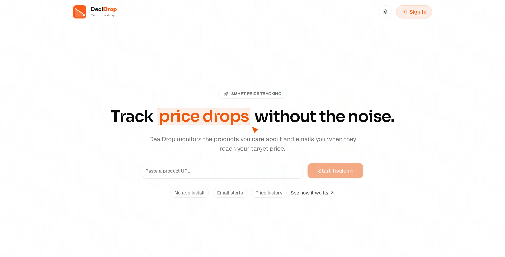
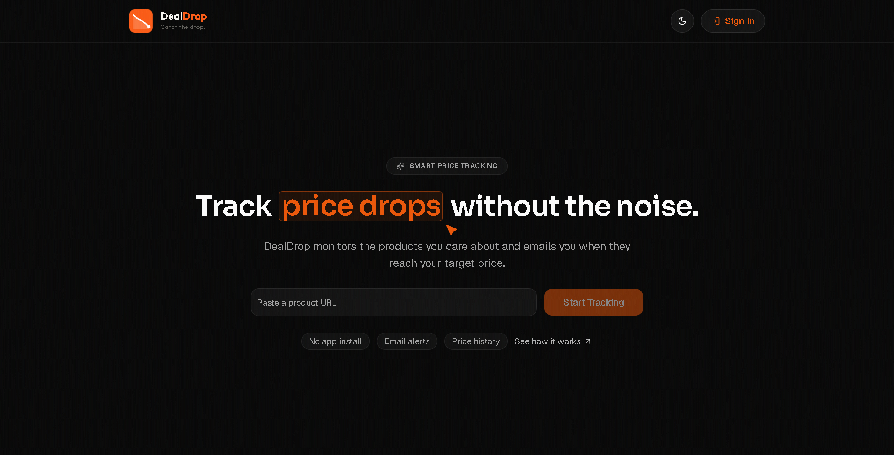

# DealDrop

<p align="center">
  <picture>
    <source media="(prefers-color-scheme: dark)" srcset="public/logo-navbar-dark-compact.svg" />
    
  </picture>
</p>

<p align="center">
  <strong>Track product prices, get drop alerts, and act fast.</strong>
</p>

<p align="center">
  <a href="https://deals.r6t9.space/">Live Demo</a>
  ·
  <a href="https://github.com/RexSixT9/dealdrop">Repository</a>
  ·
  <a href="#setup">Get Started</a>
</p>

<p align="center">
  
  
  
  
</p>

DealDrop is a price-tracking web app that lets users paste product links, track price changes, and get alerts when a price drops.

## Screenshots

<p align="center">
  
</p>
<p align="center">
  
</p>

## Features

- Track products by URL with instant scraping
- Watchlist with price history charts
- Email alerts on price drops
- Supabase auth with Google and GitHub OAuth, plus per-user product tracking
- Scheduled price checks via cron endpoint

## Tech Stack

- Next.js (App Router)
- React
- TypeScript
- Tailwind CSS
- Supabase (auth + database)
- Firecrawl (product scraping)
- Resend (email notifications)
- Recharts (price charts)

## How It Works

1. Sign in with Supabase auth to create your private watchlist.
2. Paste a product URL to start tracking; Firecrawl scrapes title, price, and image.
3. A cron job calls the check endpoint to refresh prices on a schedule.
4. Price history is stored in Supabase and displayed in charts.
5. When the price drops, Resend sends an alert email with a direct link.

## Setup

### Prerequisites

- Node.js 18 or newer
- Supabase project (auth + database)
- Firecrawl API key
- Resend API key and sender address
- Google and GitHub OAuth credentials

### Install

```bash
git clone https://github.com/RexSixT9/dealdrop.git
cd dealdrop
npm install
```

### Configure Supabase

- Configure database schema and RLS policies for `products` and `price_history`.
- Enable Google and GitHub providers in Authentication > Providers.
- Set Authentication > URL Configuration:
  - Site URL: your deployed domain
  - Additional Redirect URLs: `https://YOUR_DOMAIN/auth/callback` and any local dev callback URLs
- Copy the Supabase project URL and publishable key from Settings > API.

### Environment Variables

Create a `.env.local` file in the project root:

```bash
NEXT_PUBLIC_SUPABASE_URL=
NEXT_PUBLIC_SUPABASE_PUBLISHABLE_KEY=
# or use NEXT_PUBLIC_SUPABASE_ANON_KEY instead

SUPABASE_SERVICE_ROLE_KEY=

FIRECRAWL_API_KEY=

RESEND_API_KEY=
RESEND_FROM_EMAIL=

NEXT_PUBLIC_APP_URL=http://localhost:3000

CRON_SECRET=

# Optional tracking limit per account
MAX_TRACKED_URLS=4
```

### Run locally

```bash
npm run dev
```

Open http://localhost:3000 to view the app.

## Project Structure

```text
dealdrop/
├── app/              # App Router pages and routes
├── components/       # UI and feature components
├── constants/        # Static content
├── lib/              # Supabase, Firecrawl, and utilities
├── public/           # Static assets
└── proxy.ts          # Next.js proxy
```

## Scripts

- `npm run dev` - start dev server
- `npm run dev:m` - start dev server (0.0.0.0)
- `npm run build` - build for production
- `npm run start` - start production server
- `npm run lint` - run ESLint

## Production Deployment

1. Set all environment variables in your hosting provider.
2. Set `NEXT_PUBLIC_APP_URL` to the deployed origin.
3. Update Supabase Authentication > URL Configuration to match the live domain.
4. Configure a scheduled request to `/api/cron/check-prices` with the `CRON_SECRET` bearer token.
5. Redeploy after changing auth or environment settings.

## Cron Price Checks

Price checks run through the route handler in [app/api/cron/check-prices/route.ts](app/api/cron/check-prices/route.ts).

```bash
curl -X POST \
  -H "Authorization: Bearer <CRON_SECRET>" \
  http://localhost:3000/api/cron/check-prices
```

## Troubleshooting

- Login redirects to the wrong domain: verify `NEXT_PUBLIC_APP_URL` and Supabase Site URL / Redirect URLs.
- OAuth sign-in fails: confirm provider settings and the Supabase OAuth callback URL.
- Cron job does not update products: confirm `SUPABASE_SERVICE_ROLE_KEY` and `CRON_SECRET` in production.
- Emails are not sending: verify Resend API key and sender domain.
- Product scraping fails: check Firecrawl logs and validate the product URL is public.

## License

Apache License 2.0
