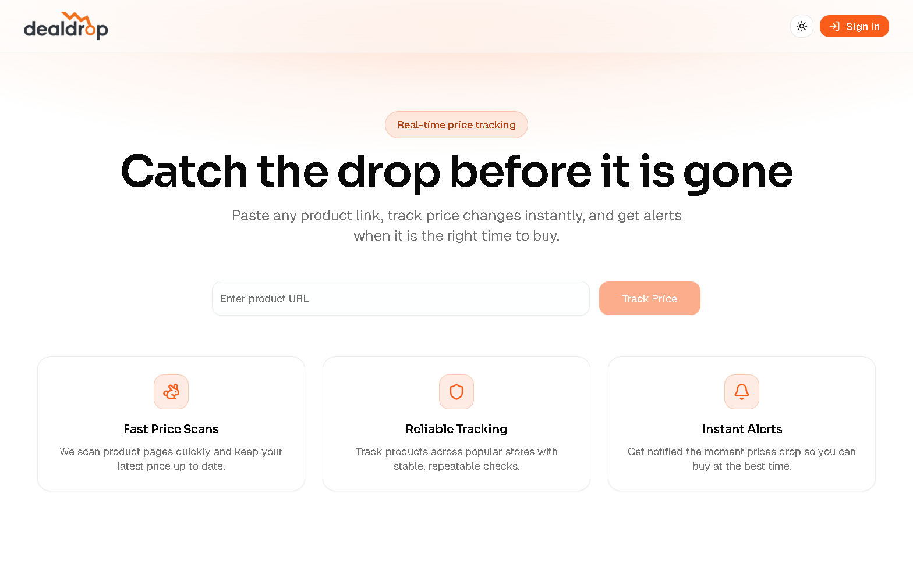
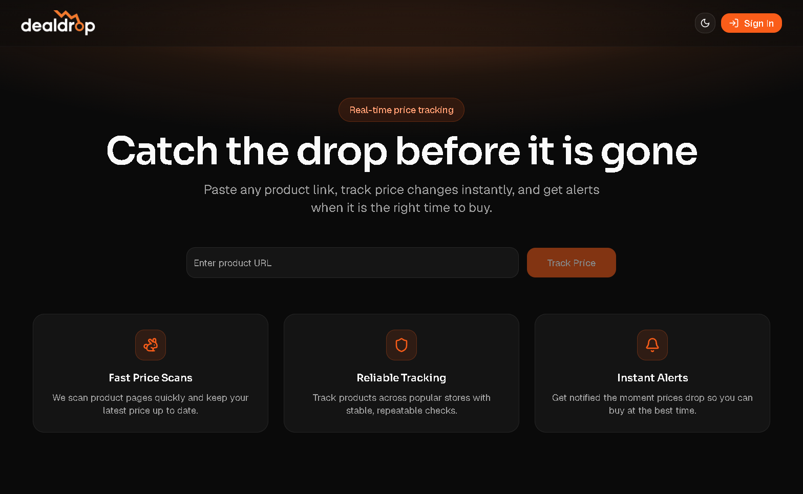

# DealDrop

<p align="center">
	<picture>
		<source media="(prefers-color-scheme: dark)" srcset="public/logos.png" />
		
	</picture>
</p>

<p align="center">
	<strong>Track product prices, get drop alerts, and act fast.</strong>
</p>

<p align="center">
	<a href="https://deal-drops.vercel.app/">Live Demo</a>
	·
	<a href="https://github.com/RexSixT9/dealdrop">Repository</a>
	·
	<a href="#getting-started-">Get Started</a>
</p>

<p align="center">
	
	
	
	
</p>

DealDrop is a price-tracking web app that lets users paste product links, track price changes, and get alerts when a price drops. 📉

## Screenshots 📸

**Desktop**

| Light | Dark |
| --- | --- |
|  |  |


## Features ✨

- Track products by URL with instant scraping 🔎
- Watchlist with price history charts 📊
- Email alerts on price drops 📬
- Supabase auth and per-user product tracking 🔐
- Scheduled price checks via cron endpoint ⏱️

## Tech Stack 🧰

- Next.js (App Router)
- React
- TypeScript
- Tailwind CSS
- Supabase (auth + database)
- Firecrawl (product scraping)
- Resend (email notifications)
- Recharts (price charts)

## Architecture 🧭

- UI in App Router pages and components
- Server actions for product add/delete and history reads
- Supabase for auth, products, and price history
- Firecrawl for scraping product metadata and prices
- Cron endpoint for scheduled price checks and alert fan-out

## Getting Started 🚀

Clone the repo:

```bash
git clone https://github.com/RexSixT9/dealdrop.git
cd dealdrop
```

Install dependencies:

```bash
npm install
```

Run the dev server:

```bash
npm run dev
```

Open http://localhost:3000 to view the app.

## Live Demo 🌐

https://deal-drops.vercel.app/

## Environment Variables 🔧

Create a .env.local file in the project root:

```bash
NEXT_PUBLIC_SUPABASE_URL=
NEXT_PUBLIC_SUPABASE_PUBLISHABLE_KEY=
# or use NEXT_PUBLIC_SUPABASE_ANON_KEY instead

SUPABASE_SERVICE_ROLE_KEY=

FIRECRAWL_API_KEY=

RESEND_API_KEY=
RESEND_FROM_EMAIL=

NEXT_PUBLIC_APP_URL=http://localhost:3000

CRON_SECRET=
```

Notes:

- `SUPABASE_SERVICE_ROLE_KEY` is required for the cron price check endpoint.
- `CRON_SECRET` is used as a Bearer token for scheduled checks.
- `NEXT_PUBLIC_APP_URL` is used in email templates.

## Configuration Overview ⚙️

| Variable | Used For | Required |
| --- | --- | --- |
| `NEXT_PUBLIC_SUPABASE_URL` | Supabase project URL | Yes |
| `NEXT_PUBLIC_SUPABASE_PUBLISHABLE_KEY` | Supabase client key | Yes |
| `SUPABASE_SERVICE_ROLE_KEY` | Cron price checks | Yes |
| `FIRECRAWL_API_KEY` | Product scraping | Yes |
| `RESEND_API_KEY` | Email delivery | Yes |
| `RESEND_FROM_EMAIL` | Email sender | Yes |
| `NEXT_PUBLIC_APP_URL` | Email links | Yes |
| `CRON_SECRET` | Cron auth token | Yes |

## Scripts 📦

- `npm run dev` - start dev server
- `npm run dev:m` - start dev server (0.0.0.0)
- `npm run build` - build for production
- `npm run start` - start production server
- `npm run lint` - run ESLint

## Cron Price Checks 🕒

Price checks run through the route handler in [app/api/cron/check-prices/route.ts](app/api/cron/check-prices/route.ts).

Example request:

```bash
curl -X POST \
	-H "Authorization: Bearer <CRON_SECRET>" \
	http://localhost:3000/api/cron/check-prices
```

## Deployment 📤

- Set all environment variables in your hosting provider.
- For scheduled checks, configure a cron job to call the endpoint above.

## Contributing 🤝

1. Fork the repo
2. Create a feature branch
3. Submit a pull request

## License 📄

Apache License 2.0
